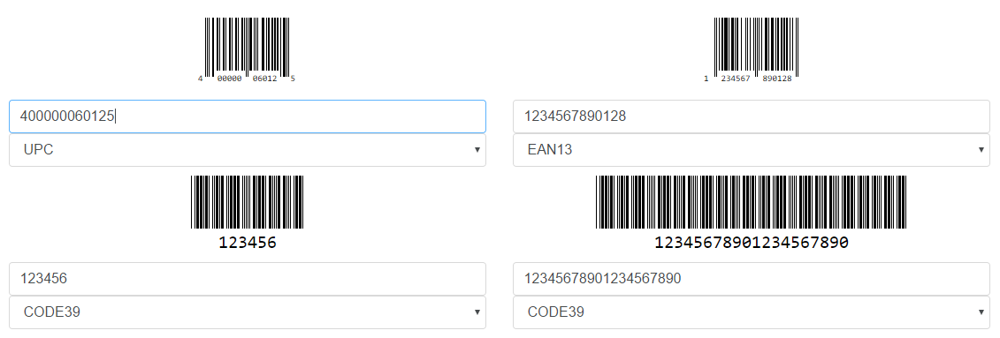

# Barcode Generator

Barcode generator based on [JsBarcode](https://github.com/lindell/JsBarcode).

This helps to print multiple barcodes stacked on a single page and use it for scanning.

Print more codes on a page and save paper!